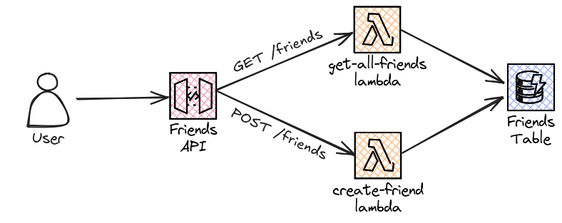

# 🚀 API Testing Workshop

This repository contains the materials for a workshop on API testing. The workshop focuses on building and testing a "Friends" API using Python, AWS CDK, Docker, LocalStack, and the OpenAPI specification.

## 📋 Requirements

Python 3.10

1. Download the latest version of Python from the [official website](https://www.python.org/downloads/).
2. Follow the instructions in the installer to install Python on your system.
3. Verify the installation by opening a terminal and running: `python --version`. You should see `Python 3.10.x`.

Poetry

1. Install Python's package manager Poetry by running: `pip install poetry`.
2. Verify the installation by running: `poetry --version`.

AWS CDK and CDK Local 2.1.0

1. Install Node.js from the [official website](https://nodejs.org/en/download/).
2. Open a terminal and install AWS CDK by running: `npm install -g aws-cdk-local aws-cdk`.
3. Verify the installation by running: `cdk --version`. You should see `2.1.0`.

Docker

1. Download Docker Desktop from the [official website](https://www.docker.com/products/docker-desktop).
2. Follow the instructions in the installer to install Docker on your system.
3. Verify the installation by opening a terminal and running: `docker --version`.

## 🛠️ Setup Instructions

1. Clone this repository to your local machine.
2. Install the required Python packages using Poetry: `poetry install`
3. Start LocalStack using Docker Compose: `docker-compose up -d`
4. Deploy the API and Lambda functions using AWS CDK: `cdk deploy`

## What is the Friends API?
The Friends API is a RESTful API that allows users to manage and retrieve information about their friends.

### 📖 API Specification

The API is defined using the OpenAPI specification. You can view the complete specification [here](link_to_openapi_spec).

### 👷‍♀️ Architecture Diagrams

Here are the architecture diagrams for the Friends API:

<picture>
    <source srcset="current-architecture-dark.png" media="(prefers-color-scheme: dark)">
    
</picture>

### 🎯 Session Objective

The main goal of this session is to implement and test the "Get Specific Friend" endpoint. This endpoint allows users to retrieve information about a specific friend in the Friends API. Participants will learn how to define the API specification using OpenAPI, implement the endpoint using AWS Lambda, and write tests using Python.